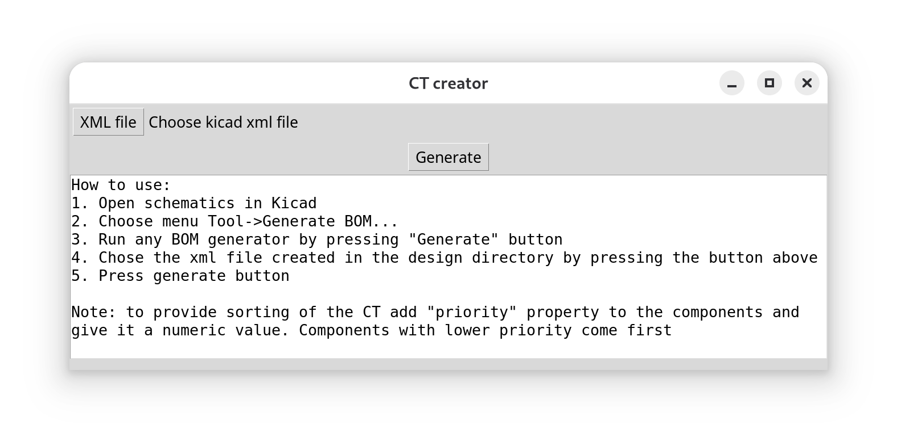
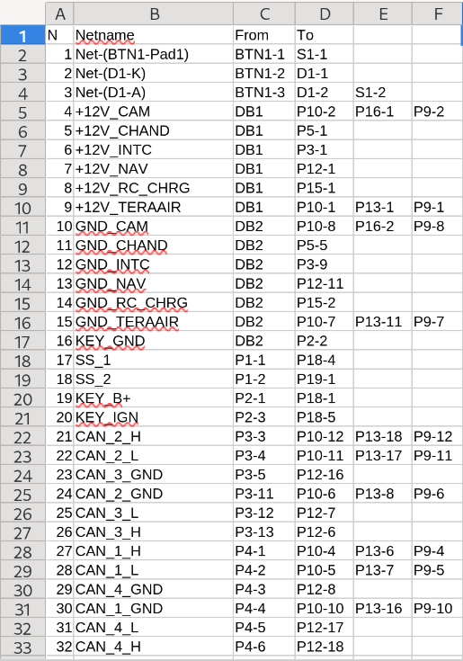

# KiCad Connectivity Table Creator

A small desktop tool that turns a KiCad schematic into a **connectivity table (CT)** — a CSV that lists, for every net, which component pins are wired together. It is intended for cable/harness documentation and point-to-point wiring checks, where you need a human-readable "from / to" list rather than a PCB layout.

The tool reads the generic XML netlist that KiCad's Eeschema exports, groups the connections by component, and writes a CSV next to the source file.

## Screenshots

*Main window — select the exported XML netlist and generate the table:*



*Resulting connectivity table opened in a spreadsheet:*



## Features

- Simple Tkinter GUI — pick an XML file, press **Generate**.
- Output CSV with one row per net: `N, Netname, From, To, ...` (additional columns are added when a net touches more than two pins).
- Nets with only a single node are dropped automatically (only real connections are reported).
- Leading `/` is stripped from hierarchical net names for readability.
- **Custom row ordering** via a `priority` field on components (see below).
- Pins of the same component are sorted by reference and pin number, so the table reads consistently.

## Requirements

- Python 3 (standard library only — `tkinter` and `csv`).
- A KiCad schematic from which you can export a generic XML netlist.

No third-party packages are needed. `kicad_netlist_reader.py` is the helper module shipped by KiCad for parsing its generic netlist format and is bundled here.

## Usage

1. Open your schematic in KiCad Eeschema.
2. Go to **Tools → Generate BOM…**.
3. Run any BOM generator (press **Generate** in the BOM dialog). This produces a `<project>.xml` file in the design directory.
4. Launch the tool:
   ```bash
   python CT_creator.py
   ```
5. Press **XML file** and select the `.xml` generated in step 3.
6. Press **Generate**.

The result is written alongside the source file as `<project> CT.csv`, and the output path is shown in the window. Any errors are printed in the same text box with a full traceback.

## Output format

| Column    | Meaning                                                         |
|-----------|-----------------------------------------------------------------|
| `N`       | Row number                                                      |
| `Netname` | Net name from the schematic                                     |
| `From`    | First node on the net, formatted as `REF-PIN` (e.g. `J1-3`)     |
| `To`, …   | Remaining nodes on the same net                                 |

If a node has no pin number, only the reference is written.

## Controlling row order with `priority`

By default, components are sorted alphanumerically by reference designator (so `A1, A2, A10, B2, …` sort naturally rather than lexically).

To pull specific components to the top of the table, add a **`priority`** field to those symbols in the schematic and give it a numeric value:

- Components **with** a `priority` field are listed first, in ascending order (lower value = higher up).
- Components **without** `priority` follow, sorted by reference.

This is handy when, for example, you want connectors or terminal blocks to lead the connectivity table regardless of their reference designators.

> Add the field via the symbol properties in Eeschema (Edit Symbol → add a field named `priority` with a numeric value). It is exported into the XML netlist and read automatically.

## How it works

- `CT_creator.py` — the Tkinter GUI and CSV export.
- `netlist_components.py` — domain model (`KicadNet`, `KicadNode`, `KicadNetlist`) that loads the netlist, filters single-node nets, applies the `priority`/reference sorting, and builds the per-component connectivity table.
- `kicad_netlist_reader.py` — KiCad's generic XML netlist parser (vendored helper).

## License

See [LICENSE](LICENSE) (MIT).
